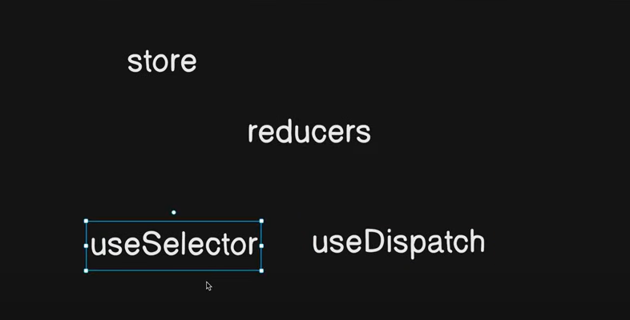

# Redux-Toolkit :

You can't modify or mutate the state.
You can only modify your state by reducers.



Follow this URL for your reference : (official redux-site)

```
https://redux-toolkit.js.org/introduction/getting-started
```

**How to install Redux-toolkit in your existing app :**

```
npm install @reduxjs/toolkit
```

```
npm install react-redux
```

**How to use Redux-toolkit**

```
Redux Toolkit includes these APIs:

configureStore():

wraps createStore to provide simplified configuration options and good defaults. It can automatically combine your slice reducers, adds whatever Redux middleware you supply, includes redux-thunk by default, and enables use of the Redux DevTools Extension.


createReducer():

that lets you supply a lookup table of action types to case reducer functions, rather than writing switch statements. In addition, it automatically uses the immer library to let you write simpler immutable updates with normal mutative code, like state.todos[3].completed = true.


createAction():

generates an action creator function for the given action type string.


createSlice():

accepts an object of reducer functions, a slice name, and an initial state value, and automatically generates a slice reducer with corresponding action creators and action types.


combineSlices():

combines multiple slices into a single reducer, and allows "lazy loading" of slices after initialisation.


createAsyncThunk:

accepts an action type string and a function that returns a promise, and generates a thunk that dispatches pending/fulfilled/rejected action types based on that promise


createEntityAdapter:

generates a set of reusable reducers and selectors to manage normalized data in the store
The createSelector utility from the Reselect library, re-exported for ease of use.

```

```
Redux toolkit ki notes :

1. Create Store - single source of truth
it has configureStore
introduce reducer

2. Create Slice(functions) method(createSlice)
Slice has name, initialState, reducers :{key: function}
Access of two things (State, action)
state = state value in the store
action = action.payload
export individual functionality
export main source export

3. Add Todo - Give values to State i.e Dispatch Courier  = use method useDispatch()
 dispatch(addTodo())

4. Take Values - useSelector((state) =>state.todos) state ka access chaiye
variable me values lelo ek baar aagaie uske baad pure JS concept hai
```
